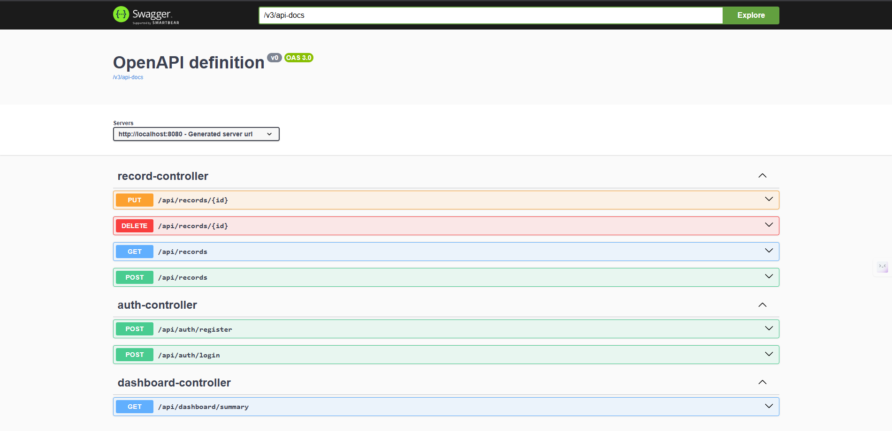
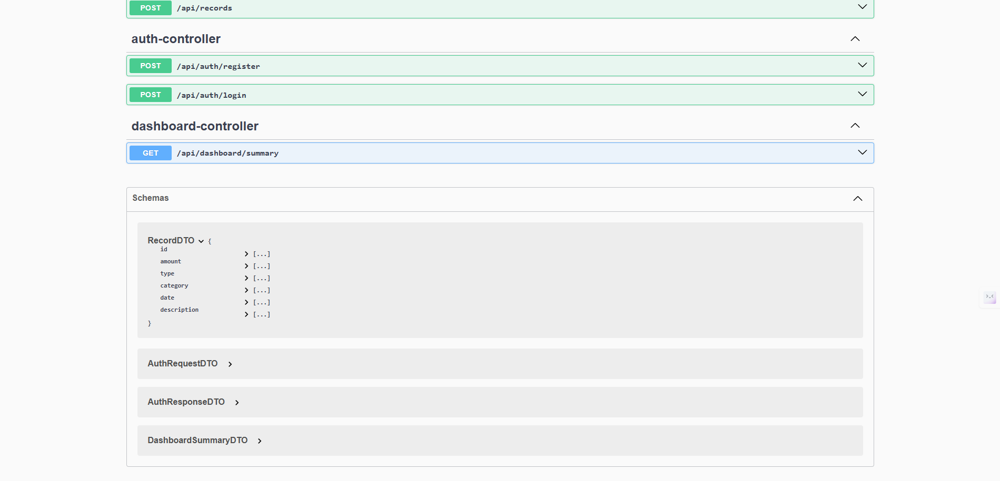
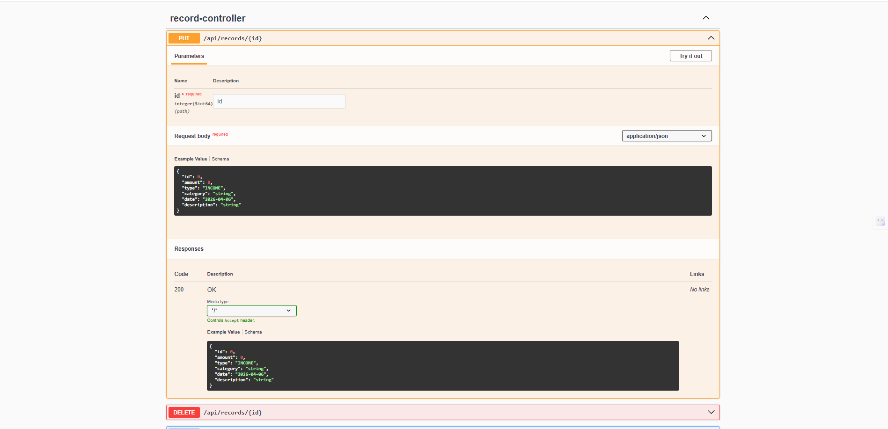

# Finance Data Processing and Access Control API

A professional Spring Boot backend for a finance dashboard, featuring secure authentication, role-based access control (RBAC), and robust data processing.

## 🔗 API Documentation

> **Live deployment hosted on Render.**

### 🌐 Live (Deployed)
| Resource | URL |
|----------|-----|
| 🟢 Swagger UI (Interactive) | [https://finance-data-processing-v3ds.onrender.com/swagger-ui/index.html](https://finance-data-processing-v3ds.onrender.com/swagger-ui/index.html) |
| OpenAPI JSON Spec | [https://finance-data-processing-v3ds.onrender.com/v3/api-docs](https://finance-data-processing-v3ds.onrender.com/v3/api-docs) |
| OpenAPI YAML Spec | [https://finance-data-processing-v3ds.onrender.com/v3/api-docs.yaml](https://finance-data-processing-v3ds.onrender.com/v3/api-docs.yaml) |

> ⚠️ Hosted on Render free tier — may take ~30 seconds to wake up on first request.

### 💻 Local (Run Locally)
| Resource | URL |
|----------|-----|
| Swagger UI (Interactive) | [http://localhost:8080/swagger-ui/index.html](http://localhost:8080/swagger-ui/index.html) |
| OpenAPI JSON Spec | [http://localhost:8080/v3/api-docs](http://localhost:8080/v3/api-docs) |
| OpenAPI YAML Spec | [http://localhost:8080/v3/api-docs.yaml](http://localhost:8080/v3/api-docs.yaml) |


## 🚀 Features

- **User & Role Management**: Register, Log In, and assign roles (`ROLE_ADMIN`, `ROLE_ANALYST`, `ROLE_VIEWER`).
- **Financial Records**: Full CRUD for income/expense entries with precise `BigDecimal` calculations.
- **Role-Based Access Control**:
  - `Admin`: Full control over all records.
  - `Analyst`: View-only access to records and aggregate dashboard summaries.
  - `Viewer`: View-only access to their own financial entries.
- **Filtering & Summaries**: Advanced filtering by category, type, and date range; plus real-time dashboard analytics.
- **Security**: Stateless JWT-based authentication with Spring Security.
- **API Documentation**: Automated Swagger UI for easy endpoint testing.
- **PostgreSQL Persistence**: Production-ready database support with Docker.

## 🛠️ Tech Stack

- **Core**: Java 17, Spring Boot 3.3.6
- **Persistence**: Hibernate/JPA, PostgreSQL
- **Security**: Spring Security, JJWT
- **Mapping**: ModelMapper, Lombok
- **Documentation**: SpringDoc OpenAPI (Swagger UI)

## 🏃 Getting Started

### 1. Prerequisites
- Docker & Docker Compose
- Java 17+
- Maven

### 2. Run Database (PostgreSQL)
The application is pre-configured to connect to a **Railway Cloud Database**. 
- **Region**: US West (California)
- **URL**: `jdbc:postgresql://junction.proxy.rlwy.net:24867/railway?options=-c%20timezone=UTC`

You do NOT need to run a local database, but a `docker-compose.yml` is provided if you wish to switch back to a local instance.

### 3. Build & Run Application
```bash
./mvnw.cmd spring-boot:run
```

## 📖 API Documentation

Once the application is running, you can access the interactive API documentation and raw OpenAPI specifications:

### Swagger UI Screenshots
> **Note to user:** Replace the paths below with your actual screenshot URLs if needed.
> 
> 
> 
> 

- **Swagger UI**: [http://localhost:8080/swagger-ui/index.html](http://localhost:8080/swagger-ui/index.html)
- **OpenAPI JSON**: [http://localhost:8080/v3/api-docs](http://localhost:8080/v3/api-docs)
- **OpenAPI YAML**: [http://localhost:8080/v3/api-docs.yaml](http://localhost:8080/v3/api-docs.yaml)

### Key Endpoints:
- `POST /api/auth/register`: Create a new user with a specified role.
- `POST /api/auth/login`: Authenticate and receive a JWT token.
- `GET /api/records`: List and filter financial records (requires authentication).
- `POST /api/records`: Create a new record (Admin only).
- `GET /api/dashboard/summary`: Get aggregated totals (Admin/Analyst only).

## 🛡️ Security Workflow

1.  **Register** an Admin user: `POST /api/auth/register` with `role: ROLE_ADMIN`.
2.  **Login** to get the Bearer Token: `POST /api/auth/login`.
3.  **Authorize** requests by adding the `Authorization: Bearer <token>` header.

## ⚙️ Assumptions & Design Decisions
- **H2 Fallback**: While PostgreSQL is primary, the app is built to be easily switchable back to H2 for local testing via separate profiles.
- **Precision**: `BigDecimal` is used for all "Amount" fields to ensure no precision loss in financial calculations.
- **RBAC Prefixing**: Roles are stored in the database with the `ROLE_` prefix to strictly adhere to Spring Security best practices.

---
*This project was built as part of a Backend Development Assignment.*
